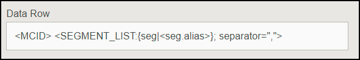

# 目标设置疑难解答 {#destination-setup-troubleshooting}

此信息可帮助您在Audience Manager中设置目标并避免常见问题。

## 我设置了一个目标，但看不到任何文件。 它们在哪里？ {#destination-no-files}

<!-- c_dest_tshooting.xml -->

常见的目标配置问题包括以下问题：

### 目标配置错误

* **不正确的[!UICONTROL UserID]键：** [!UICONTROL UserID]键是此目标的[!UICONTROL MasterDPID]，是将被转出的ID值的基础。 即使可以通过下拉列表选择[!UICONTROL UserID]键，但这并不一定意味着有ID/特征/区段映射到此值。 如果[!UICONTROL Outbound]进程（在创建目标后运行）未找到映射到此[!UICONTROL UserID]键的任何用户，则不会返回任何数据。
* **选择的文件数据源中没有：**&#x200B;当选择除[!UICONTROL S2S]之外的任何目标类型时，屏幕底部会出现一个标记为[!UICONTROL Configure Data Sources]的部分。 当此部分首次出现时，不会选择任何值。 如果您忘记单击[!UICONTROL All First Party]复选框或从[!UICONTROL Available Data Sources]窗口中单独选择数据源，则不会返回任何数据。

### 格式配置错误

在为出站数据选择格式时，如果可能，最好重复使用现有格式。 使用已验证的格式可确保成功生成出站数据。 要准确查看现有格式的格式，请单击菜单栏中的[!UICONTROL Formats]选项，然后按名称或ID号搜索您的格式。 格式或格式中使用的宏格式不正确，将会提供格式不正确的输出或阻止完全输出信息。

有关设置格式和使用宏的详细信息，请参阅[文件格式宏](formats/file-formats.md#)和[HTTP格式宏](formats/web-formats.md)。

### 服务器配置错误

* **[!DNL FTP]**
   * **[!UICONTROL Domain]**
      * 请勿为主机名输入任何前缀。 如果您拥有帐户[!DNL ftp://hello.com]，则只需在此字段中输入[!DNL hello.com]即可。
   * **[!UICONTROL Port/Type Combination]**
      * 对于[!DNL FTP]传输，首选传输类型为[!DNL SFTP]。
      * 选择[!DNL SFTP]类型时，端口几乎始终为22。
      * 选择[!DNL FTPs/TLS]类型时，端口几乎始终为21。
      * [!DNL FTPs/TLS]类型与常规[!DNL FTP]传输不同。 我们不支持常规（无安全） [!DNL FTP]传输。
   * **[!UICONTROL Remote Path]**
      * 在选择远程子路径时，输入该路径时不应使用前导斜杠。
      * 如果传输的文件应该放在[!DNL (root)/inbound]子文件夹中，只需为远程路径添加[!DNL inbound]即可，而不是[!DNL /inbound]。
      * 如果沿路径将文件发送到多个目录，请在每个目录之间输入斜杠。 如果您被指定了[!DNL /inbound/subdirectory1/subdirectory2]的位置，您应该在此字段中输入[!DNL inbound/subdirectory1/subdirectory2]。
      * 如果文件应放置在外部服务器自动路由到的目录中，可将此空间留空。 请勿输入句点( 。 )、斜杠( / )或任何其他内容。

* **[!DNL S3]**
   * [!DNL S3]是首选传输协议（超过[!DNL FTP]或[!DNL HTTP]）。
      * **[!UICONTROL Bucket]**
         * 存储段名称应不带斜杠、前缀、后缀等内容列出。 如果您指定了地址[!DNL s3://your-bucket]，则只需将[!DNL your-bucket]添加到此字段即可。
      * **[!UICONTROL Directory]**
         * 将此字段留空，除非为您提供了应放置数据的子目录。 如果您获得了地址[!DNL s3://your-bucket/your-subdirectory]，请在[!UICONTROL Bucket]字段中输入[!DNL your-bucket]，应将[!DNL your-subdirectory]添加到[!UICONTROL Directory]字段中。 请勿添加前面的斜杠。
         * 如果必须沿路径浏览多个目录，则仅当使用斜杠作为分隔符时。 因此，[!DNL s3://your-bucket/your-subdirectory1/your-subdirectory2]的位置将在[!UICONTROL Bucket]字段中包含[!DNL your-bucket]，并在[!UICONTROL Directory]字段中输入[!DNL your-subdirectory1/your-subdirectory2]。
      * **[!UICONTROL Access / Secret Keys]**
         * 当[!DNL TechOps]创建存储段并向顾问提供访问/密钥时，这些凭据通常是要传递给客户端的`READ-ONLY`凭据。 不应将这些凭据输入到[!UICONTROL Access / Secret Key]字段中，因为这将导致传输失败（因为这些凭据是只读的，不可写入）。 在[!DNL TechOps]创建存储段并提供凭据的情况下，顾问还应请求允许将文件写入此存储段的Adobe密钥对 — 不提供给客户端。 应将该键添加到这些字段中。

* **[!DNL HTTP]**
   * **[!UICONTROL Domain]**
      * 请输入[!DNL HTTP]条目的前缀信息。 如果您拥有帐户[!DNL https://superduper.com]，请在此字段中输入[!DNL https://superduper.com]。
      * **[!UICONTROL URL Prefix]**
         * 添加[!DNL URL]前缀时，将前面的斜杠保持关闭。 [!DNL https://hello.com/r/x/y/z]的地址应在[!UICONTROL Domain]字段中输入[!DNL https://hello.com]，并在[!UICONTROL URL Prefix]字段中在此处输入[!DNL r/x/y/z]。
         * 如果不需要[!UICONTROL URL Prefix]，则将此值留空。
      * **[!UICONTROL Authentication - SSH Key]**
         * 在此框中输入完整的`SSH PRIVATE`密钥值，包括页眉、页脚和换行符，以确保加密或密钥存储准确无误。

### 没有足够的时间用于出站生成

扩展流程每天运行两次，并运行多个流程（扩展、发布、推送到外部位置等） 必须先运行，然后才能将文件推送到其最终目标。 一条经验法则是，至少应在24小时之后完全配置目标，之后才能将数据推送到外部位置。

### 文件拆分大小太大

将文件出站到目标时，可以将较大的出站文件分割为文件块。 确保单个文件块不超过10 GB。 另请参阅[出站数据文件名：语法和示例](https://experienceleague.adobe.com/docs/audience-manager/user-guide/implementation-integration-guides/receiving-audience-data/batch-outbound-data-transfers/outbound-file-name-contents.html?lang=en)。

## 如何设置目标以导出出站数据文件中的Experience CloudID、客户ID或Audience ManagerID {#set-up-destinations-export}

本页说明如何设置目标以导出[!UICONTROL Outbound Data Files]中依赖于所需ID类型的数据。

<!-- set-up-destinations-mcid-aamid.xml -->

目标允许我们的客户在任意数量的数字渠道中激活其数据。 例如，他们可以将受众数据导出到其他[!DNL Adobe Experience Cloud]解决方案（[!DNL Target]、[!DNL Campaign]等）。 或者，他们可以将数据发送到[!UICONTROL DSP]、[!UICONTROL SSP]或与Audience Manager集成的任何平台。 我们在[集成Wiki页面](https://wiki.corp.adobe.com/display/MCPI)上保存了与我们合作的合作伙伴列表。

>[!NOTE]
>
>有关在管理员UI中创建目标的详细演练，请参阅[创建或编辑公司目标](companies/admin-manage-company-destinations.md#create-edit-company-destinations)文章。

您的客户希望导出不同的ID类型，具体取决于目标。 下图显示了导出与不同ID类型相关的配置文件信息时应选择的选项。 我们建议您也参考Audience Manager](https://experienceleague.adobe.com/docs/audience-manager/user-guide/reference/ids-in-aam.html?lang=en)中的[ID索引。 需要考虑三个重要设置：[!UICONTROL User ID Key]、[!UICONTROL Data Source Type]和[!UICONTROL Format]。 我们将在下面详细介绍所有这些功能。

* [!UICONTROL User ID Key]。在[!UICONTROL Admin UI]中，转到&#x200B;**[!UICONTROL Companies]**。 搜索客户的公司并单击它。 查找&#x200B;**[!UICONTROL Destinations]**&#x200B;选项卡并按&#x200B;**[!UICONTROL Add Destination]**。 在&#x200B;**[!UICONTROL Add Destination]**&#x200B;工作流中选择[!UICONTROL User ID Key]。 [!UICONTROL User ID Key]将筛选来自目标数据源的传入ID，只允许这些ID通过。

  

* [!UICONTROL Data Source Type]。在Audience ManagerUI中创建目标时选择此选项。 首先，选择[!UICONTROL Inbound]，然后选择所需的ID类型。 选项包括：

  

* [!UICONTROL Format]。此选项决定了要导出的文件格式。 在&#x200B;**[!UICONTROL Add Destination]**&#x200B;工作流的&#x200B;**[!UICONTROL Batch Data]**&#x200B;下，选择格式。

要检查格式，请转到&#x200B;**[!UICONTROL Admin UI > Formats]**&#x200B;并查找[!UICONTROL Data Row]元素。 此元素包含文件格式为&lt;MCID>的宏，如下例所示。

<table id="table_DAEE5BC75DCB4FC690C4BAE41F627DEC"> 
 <thead> 
  <tr> 
   <th colname="col01" class="entry"> 配置编号 </th> 
   <th colname="col1" class="entry"> 
用户密钥 
 </th> 
   <th colname="col2" class="entry"> 
数据Source类型 
 </th> 
   <th colname="col3" class="entry"> 
格式 
 </th> 
   <th colname="col4" class="entry"> 
导出的ID类型 
 </th> 
  </tr>
 </thead>
 <tbody> 
  <tr> 
   <td colname="col01"> 1 </td> 
   <td colname="col1"> 
Adobe Audience Manager (0) 
 </td> 
   <td colname="col2"> 
Experience Cloud ID 
 </td> 
   <td colname="col3"> 
&lt;DP_UUID&gt; 
 </td> 
   <td colname="col4"> 
Experience Cloud ID 
 </td> 
  </tr> 
  <tr> 
   <td colname="col01"> 2 </td> 
   <td colname="col1"> 
Adobe Audience Manager (0) 
 </td> 
   <td colname="col2"> 
Experience Cloud ID 
 </td> 
   <td colname="col3"> 
MCID 
 </td> 
   <td colname="col4"> 
AUDIENCE MANAGERUUID 
 </td> 
  </tr> 
  <tr> 
   <td colname="col01"> 3 </td> 
   <td colname="col1"> 
Adobe Audience Manager (0) 
 </td> 
   <td colname="col2"> 
Experience Cloud ID 
 </td> 
   <td colname="col3"> 
UUID 
 </td> 
   <td colname="col4"> 
Experience Cloud ID 
 </td> 
  </tr> 
  <tr> 
   <td colname="col01"> 4 </td> 
   <td colname="col1"> 
Adobe Audience Manager (0) 
 </td> 
   <td colname="col2"> 
AUDIENCE MANAGERID 
 </td> 
   <td colname="col3"> 
&lt;DP_UUID&gt; 
 </td> 
   <td colname="col4"> 
AUDIENCE MANAGERUUID 
 </td> 
  </tr> 
  <tr> 
   <td colname="col01"> 5 </td> 
   <td colname="col1"> 
Adobe Audience Manager (0) 
 </td> 
   <td colname="col2"> 
AUDIENCE MANAGERID 
 </td> 
   <td colname="col3"> 
MCID 
 </td> 
   <td colname="col4"> 
Experience Cloud ID 
 </td> 
  </tr> 
  <tr> 
   <td colname="col01"> 6 </td> 
   <td colname="col1"> 
Adobe Audience Manager (0) 
 </td> 
   <td colname="col2"> 
AUDIENCE MANAGERID 
 </td> 
   <td colname="col3"> 
UUID 
 </td> 
   <td colname="col4"> 
AUDIENCE MANAGERUUID 
 </td> 
  </tr> 
  <tr> 
   <td colname="col01"> 7 </td> 
   <td colname="col1"> 
DPID（公司有权访问的任何数据源） 
 </td> 
   <td colname="col2"> 
客户 ID 
 </td> 
   <td colname="col3"> 
&lt;DP_UUID&gt; 
 </td> 
   <td colname="col4"> 
客户ID (DPUUID) 
 </td> 
  </tr> 
  <tr> 
   <td colname="col01"> 8 </td> 
   <td colname="col1"> 
DPID（公司有权访问的任何数据源） 
 </td> 
   <td colname="col2"> 
客户 ID 
 </td> 
   <td colname="col3"> 
MCID 
 </td> 
   <td colname="col4"> 
Experience Cloud ID 
 </td> 
  </tr> 
  <tr> 
   <td colname="col01"> 9 </td> 
   <td colname="col1"> 
DPID（公司有权访问的任何数据源） 
 </td> 
   <td colname="col2"> 
客户 ID 
 </td> 
   <td colname="col3"> 
UUID 
 </td> 
   <td colname="col4"> 
AUDIENCE MANAGERUUID 
 </td> 
  </tr> 
  <tr> 
   <td colname="col01"> 10 </td> 
   <td colname="col1"> 
DPID（公司有权访问的任何数据源） 
 </td> 
   <td colname="col2"> 
AUDIENCE MANAGERID 
 </td> 
   <td colname="col3"> 
&lt;DP_UUID&gt; 
 </td> 
   <td colname="col4"> 
AUDIENCE MANAGERUUID 
 </td> 
  </tr> 
  <tr> 
   <td colname="col01"> 11 </td> 
   <td colname="col1"> 
DPID（公司有权访问的任何数据源） 
 </td> 
   <td colname="col2"> 
AUDIENCE MANAGERID 
 </td> 
   <td colname="col3"> 
MCID 
 </td> 
   <td colname="col4"> 
Experience Cloud ID 
 </td> 
  </tr> 
  <tr> 
   <td colname="col01"> 12 </td> 
   <td colname="col1"> 
DPID（公司有权访问的任何数据源） 
 </td> 
   <td colname="col2"> 
AUDIENCE MANAGERID 
 </td> 
   <td colname="col3"> 
UUID 
 </td> 
   <td colname="col4"> 
AUDIENCE MANAGERUUID 
 </td> 
  </tr> 
 </tbody> 
</table>

## 用例

假设您使用Audience Manager和[!DNL Campaign]。 为了使客户数据可在[!DNL Campaign]中操作，您需要导出[!UICONTROL Experience Cloud IDs]。 在这种情况下，您应该使用配置编号3。
