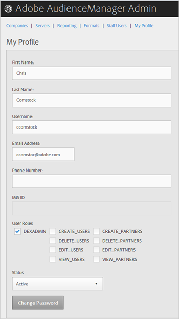

# 我的个人资料 {#my-profile}

编辑Audience Manager管理工具配置文件的详细信息或更改密码。

<!-- c_my_profile.xml -->

## 编辑个人资料 {#edit-profile}

查看和编辑Audience Manager管理工具配置文件，包括名字和姓氏、用户名、电子邮件地址、电话号码、[!UICONTROL IMS ID]、用户角色和状态。

<!-- t_edit_profile.xml -->

1. 单击 **[!UICONTROL My Profile]**。

   

2. 填写以下字段：
   * **[!UICONTROL First Name]：**（必需）指定您的名字。
   * **[!UICONTROL Last Name]：**（必需）指定您的姓氏。
   * **[!UICONTROL Username]：**（必需）指定您的第一个用户名。
   * **[!UICONTROL Email Address]：**（必需）指定您的电子邮件地址。
   * **[!UICONTROL Phone Number]：**&#x200B;指定您的电话号码。
   * **[!UICONTROL IMS ID]：**&#x200B;指定您的Internet消息服务ID。
   * **[!UICONTROL User Roles]：**&#x200B;选择所需的用户角色：
      * **[!UICONTROL DEXADMIN]：**&#x200B;提供在Audience Manager管理工具中执行任务的管理员访问权限。 如果不选择此选项，则可以选择单个角色。 这些角色允许用户使用[!DNL API]调用执行任务，但不能在管理工具中执行。
      * **[!UICONTROL CREATE_USERS]：**&#x200B;允许用户使用[!DNL API]调用创建新用户。
      * **[!UICONTROL DELETE_USERS]：**&#x200B;允许用户使用[!DNL API]调用删除现有用户。
      * **[!UICONTROL EDIT_USERS]：**&#x200B;允许用户使用[!DNL API]调用编辑现有用户。
      * **[!UICONTROL VIEW_USERS]：**&#x200B;允许用户使用[!DNL API]调用查看您Audience Manager配置中的其他用户。
      * **[!UICONTROL CREATE_PARTNERS]：**&#x200B;允许用户使用[!DNL API]调用创建Audience Manager合作伙伴。
      * **[!UICONTROL DELETE_PARTNERS]：**&#x200B;允许用户使用[!DNL API]调用删除Audience Manager合作伙伴。
      * **[!UICONTROL EDIT_PARTNERS]：**&#x200B;允许用户使用[!DNL API]调用编辑Audience Manager合作伙伴。
      * **[!UICONTROL VIEW_PARNTERS]：**&#x200B;允许用户使用[!DNL API]调用查看Audience Manager合作伙伴。
   * **[!UICONTROL Status]：**&#x200B;选择所需的状态：
      * **[!UICONTROL Active]：**&#x200B;指定此用户为活动的Audience Manager用户。
      * **[!UICONTROL Deactivated]：**&#x200B;指定此用户是受众管理中的已停用用户。
      * **[!UICONTROL Expired]：**&#x200B;指定此用户在Audience Manager中的帐户已过期。
      * **[!UICONTROL Locked Out]：**&#x200B;指定该用户在Audience Manager中的帐户已锁定。
3. 单击 **[!UICONTROL Submit]**。

## 更改密码 {#change-password}

更改您的Audience Manager管理工具密码。

<!-- t_change_password.xml -->

1. 单击 **[!UICONTROL My Profile]**。
1. 单击 **[!UICONTROL Change Password]**。

   

   您的Audience Manager密码必须是：

   * 长度至少为8个字符；
   * 至少包含一个大写字符；
   * 至少包含一个小写字符；
   * 至少包含一个数字；
   * 至少包含一个特殊字符；
   * 以字母数字字符开头和结尾；
   * 以字母数字字符开头和结尾。

1. 指定您的旧密码。
1. 指定新密码，然后确认新密码。
1. 单击 **[!UICONTROL OK]**。
