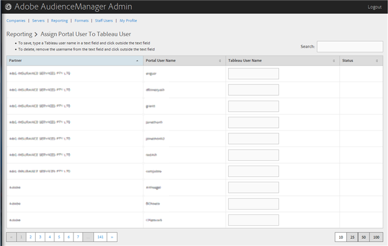

# 将门户用户分配给Tableau用户 {#assign-a-portal-user-to-tableau-user}

<!-- t_tabeau.xml -->

使用[!UICONTROL Reporting]页面使门户用户成为[!DNL Tableau]用户。 这允许用户在Audience Manager中查看[!DNL Tableau]报表。

1. 单击&#x200B;**[!UICONTROL Reporting]** > **[!UICONTROL Assign Portal User to Tableau User]**。

   

1. 要分配用户，请在所需的合作伙伴行中，在文本字段中键入[!DNL Tableau]用户名，然后单击文本字段的外部。

要删除用户分配，请在所需的伙伴行中，从文本字段中删除用户名，然后单击文本字段外部。
