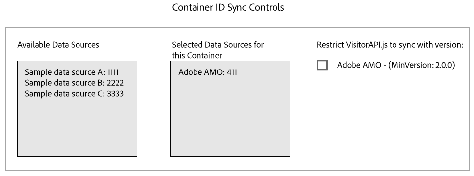

# ID与Media Optimizer同步 {#id-syncing-with-media-optimizer}

默认情况下，所有公司都与[!DNL Adobe Media Optimizer] ([!DNL AMO])同步数据。 在[!UICONTROL Admin UI]中，每个公司容器都有一个用于管理此进程的数据源。 此数据源为[!UICONTROL Adobe AMO] ([!UICONTROL ID] 411)。 单击选定公司的容器行（在[!UICONTROL Containers]选项卡下）以禁用此默认同步或向[!DNL AMO]同步进程添加和删除其他数据源。

## ID同步状态 {#id-sync-status}

下表描述了数据源的同步状态。

| 状态 | 描述 |
|------ | -------- |
| 关 | 从[!UICONTROL Selected Data Sources]中为此容器删除所有数据源以禁用与[!DNL AMO]的ID同步 |
| 开启（不论ID服务版本如何） | 数据源在以下情况下与[!DNL AMO]同步（不论ID服务版本如何）： <ul><li>数据源出现在[!UICONTROL Selected Data Sources]列表中。</li><li>未选中[!DNL AMO]复选框&#x200B;**。</li></ul> |
| 开启（不论ID服务版本如何） | 在下列情况下，数据源将与ID服务版本为2.0（或更高版本）的[!DNL AMO]同步： <ul><li>数据源出现在[!UICONTROL Selected Data Sources]列表中。</li><li>已选中[!DNL AMO]复选框&#x200B;**。</li></ul> |

>[!MORELIKETHIS]
>
>* [管理容器](../companies/admin-manage-containers.md#task_61DB5CEECC5049DD8D059C642AC3F967)
