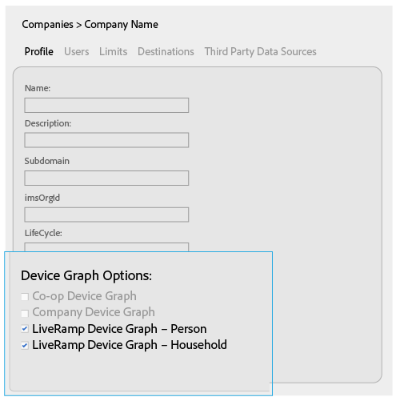

# 适用于公司的设备图选项 {#device-graph-options-for-companies}

[!UICONTROL Device Graph Options]适用于参与[!DNL Adobe Experience Cloud Device Co-op]的公司。 如果客户还与与Audience Manager集成的第三方设备图提供商存在合同关系，本节将显示该设备图的选项。 这些选项位于[!UICONTROL Companies] >公司名称> [!UICONTROL Profile] > [!UICONTROL Device Graph Options]中。

此图使用第三方设备图选项的通用名称。 在生产环境中，这些名称来自设备图提供商，可能与此处显示的名称不同。 例如，[!DNL LiveRamp]选项通常（但并非始终）：

* 开始于&quot;[!DNL LiveRamp]&quot;
* 包含中间的名称，该名称会有所不同
* 以“[!UICONTROL - Household]”或“[!UICONTROL -Person]”结尾

## 定义的设备图选项 {#device-graph-options-defined}

您在此处选择的设备图选项在创建[!UICONTROL Profile Merge Rule]时公开或隐藏[!DNL Audience Manager]客户可用的[!UICONTROL Device Options]选项。

### 协作设备图 {#co-op-graph}

参与[Adobe Experience Cloud Device Co-op](https://experienceleague.adobe.com/docs/device-co-op/using/about/overview.html?lang=en)的客户使用这些选项创建具有[确定性和概率性数据](https://experienceleague.adobe.com/docs/device-co-op/using/device-graph/links.html?lang=en)的[!UICONTROL Profile Merge Rule]。 [!DNL Corporate Provisioning Team]通过后端[!DNL API]调用激活和停用此选项。 您不能在[!DNL Admin UI]中选中或清除这些框。 另外，**[!UICONTROL Co-op Device Graph]**&#x200B;和&#x200B;**[!UICONTROL Company Device Graph]**&#x200B;选项是互斥的。 客户可以要求我们激活其中一个，但不能同时激活两者。 选中后，这会公开[!UICONTROL Profile Merge Rule]的[!UICONTROL Device Options]设置中的&#x200B;**[!UICONTROL Co-op Device Graph]**&#x200B;控件。

### 公司设备图 {#company-graph}

此选项适用于在其[!DNL Analytics]报表包中使用[!UICONTROL People]量度的[!DNL Analytics]客户。 [!DNL Corporate Provisioning Team]通过后端[!DNL API]调用激活和停用此选项。 您不能在[!DNL Admin UI]中选中或清除这些框。 另外，**[!UICONTROL Company Device Graph]**&#x200B;和&#x200B;**[!UICONTROL Co-op Device Graph]**&#x200B;选项是互斥的。 客户可以要求我们激活其中一个，但不能同时激活两者。 选中时：

* 此设备图使用属于您配置的公司的确定性数据（无概率数据）。
* [!DNL Audience Manager]自动创建名为`*`合作伙伴名称`*-Company Device Graph-Person`的[!UICONTROL Data Source]。 在[!UICONTROL Data Source]详细信息页面中，[!DNL Audience Manager]客户可以更改合作伙伴名称、描述，并将[数据导出控件](https://experienceleague.adobe.com/docs/device-co-op/using/device-graph/links.html?lang=en)应用于此数据源。
* [!DNL Audience Manager]客户&#x200B;*没有*&#x200B;在[!UICONTROL Profile Merge Rule]的[!UICONTROL Device Options]分区中看到新设置。

### LiveRamp设备图（个人或家庭） {#liveramp-device-graph}

当合作伙伴创建[!UICONTROL Data Source]并选择&#x200B;**[!UICONTROL Use as an Authenticated Profile]**&#x200B;和/或&#x200B;**[!UICONTROL Use as a Device Graph]**&#x200B;时，将在[!DNL Admin UI]中启用这些复选框。 这些设置的名称由第三方设备图形提供商确定（例如，[!DNL LiveRamp]、[!DNL TapAd]等）。 选中后，这意味着您配置的公司将使用这些设备图提供的数据。

>[!MORELIKETHIS]
>
>* [定义的配置文件合并规则选项](https://experienceleague.adobe.com/docs/audience-manager/user-guide/features/profile-merge-rules/merge-rule-definitions.html?lang=en)
>* [数据Source设置和菜单选项](https://experienceleague.adobe.com/docs/audience-manager/user-guide/features/data-sources/datasources-list-and-settings.html?lang=en)
