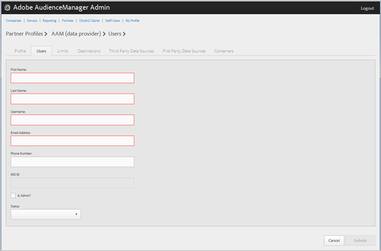

# 管理公司用户 {#manage-company-users}

创建新的Audience Manager用户或编辑和删除现有用户。

<!-- t_manage_company_users.xml -->

1. 单击&#x200B;**[!UICONTROL Companies]**，然后找到并单击所需的公司以显示其[!UICONTROL Profile]页面。

   使用列表底部的[!UICONTROL Search]框或分页控件查找所需的公司。 您可以通过单击所需列的标题，按升序或降序对每个列进行排序。
1. 单击&#x200B;**[!UICONTROL Users]**&#x200B;选项卡。
1. 要创建新用户，请单击&#x200B;**[!UICONTROL Create a New User]**。 要编辑现有用户，请在&#x200B;**[!UICONTROL Username]**&#x200B;列中查找并单击所需用户。

   

1. 填写以下字段：

   * **[!UICONTROL First Name]**： （必需）指定用户的名字。
   * **[!UICONTROL Last Name]**： （必需）指定用户的姓氏。
   * **[!UICONTROL Username]**：（必需）指定用户的Audience Manager用户名。 用户名必须是唯一的。
   * **[!UICONTROL Email Address]**： （必需）指定用户的电子邮件地址。
   * **[!UICONTROL Phone Number]**：指定用户的电话号码。
   * **[!UICONTROL IMS ID]**：用户的[!UICONTROL Identity Management System ID]。 此ID允许用户链接到Adobe Experience Cloud的Adobe解决方案。
   * **[!UICONTROL Is Admin]**：将此用户设为Audience Manager管理用户。 管理员拥有此合作伙伴的所有Audience Manager用户角色。
   * **[!UICONTROL Status]**：创建新用户时，此字段最初显示为&#x200B;**[!UICONTROL Pending]**，直到用户登录并重置临时密码为止。 如果您正在编辑现有用户，则可以从以下状态中选择：
      * **[!UICONTROL Active]**：指定此用户是活动的Audience Manager用户。
      * **[!UICONTROL Deactivated]**：指定此用户是已停用的Audience Manager用户。
      * **[!UICONTROL Expired]**：指定此用户是过期用户。
      * **[!UICONTROL Locked Out]**：指定此用户为锁定用户。

1. 单击 **[!UICONTROL Submit]**。

## 删除用户 {#delete-user}

要删除用户，请执行以下操作：

1. 单击&#x200B;**[!UICONTROL Companies]**，找到并单击所需的公司，然后单击&#x200B;**[!UICONTROL Users]**&#x200B;选项卡。
1. 在所需用户的&#x200B;**[!UICONTROL Actions]**&#x200B;列中单击。
1. 单击&#x200B;**[!UICONTROL OK]**&#x200B;以确认删除。
