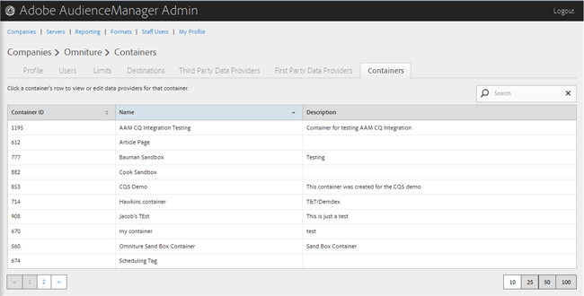
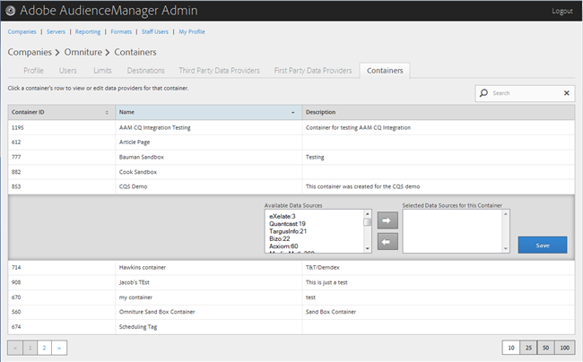

# 管理容器 {#manage-containers}

查看或编辑容器的数据提供程序。

<!-- t_containers.xml -->

>[!NOTE]
>
>默认情况下，公司会创建一个容器。 您可以在&#x200B;**[!UICONTROL Tools > Tags]**&#x200B;的用户界面中为公司创建其他容器。

1. 单击&#x200B;**[!UICONTROL Companies]**，然后找到并单击所需的公司以显示其[!UICONTROL Profile]页面。

   使用列表底部的[!UICONTROL Search]框或分页控件查找所需的公司。 您可以通过单击所需列的标题，按升序或降序对每个列进行排序。

1. 单击&#x200B;**[!UICONTROL Containers]**&#x200B;选项卡。

   

1. 单击容器的行可查看或编辑该容器的数据提供程序。

   

1. 从&#x200B;**[!UICONTROL Available Data Sources]**&#x200B;和&#x200B;**[!UICONTROL Selected Data Sources for This Container]**&#x200B;列表中移动数据源，方法是选择所需的数据源，然后根据需要单击向右箭头或向左箭头。

   您还可以从[第三方数据提供程序](../companies/admin-third-party-providers.md#task_E942DD674D794BA6B8EFD52FD866E689)页面执行此任务。

1. 如果您进行了更改，请单击&#x200B;**[!UICONTROL Save]**。

>[!MORELIKETHIS]
>
>* [ID 与 Media Optimizer 同步](../companies/admin-amo-sync.md#concept_2B5537233DAA4860B3503B344F937D83)
