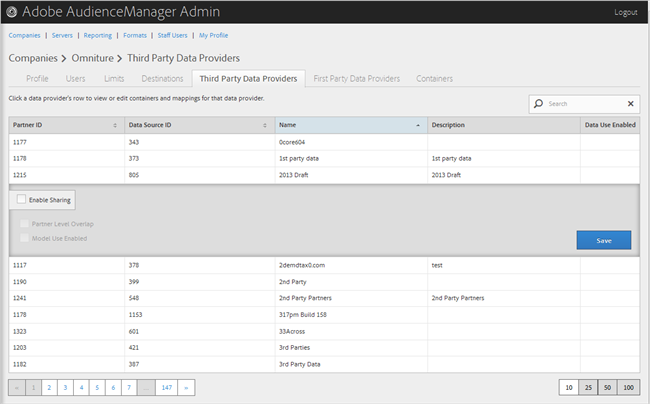

# 管理第三方数据提供商 {#manage-third-party-data-providers}

查看或编辑第三方数据提供商的容器和映射。 您还可以启用与不同数据提供商的共享。

1. 单击&#x200B;**[!UICONTROL Companies]**，然后找到并单击所需的公司以显示其[!UICONTROL Profile]页面。

   使用列表底部的[!UICONTROL Search]框或分页控件查找所需的公司。 您可以通过单击所需列的标题，按升序或降序对每个列进行排序。
1. 单击&#x200B;**[!UICONTROL Third Party Data Providers]**&#x200B;选项卡。

   

1. 单击数据提供程序的行可查看或编辑该数据提供程序的容器和映射。

   

1. 选择&#x200B;**[!UICONTROL Enable Sharing]**&#x200B;以启用以下选项：

   * **合作伙伴级别重叠：**
   * **模型使用已启用：**&#x200B;允许该公司在创建算法模型时使用此数据提供程序。

   启用共享后，您将从此数据提供程序获得对特征的访问权限。

1. （视情况而定）如果此提供程序启用了容器，则可以通过将所需容器从可用列表移动到选定列表来选择此数据提供程序的容器。

   您还可以从[容器](../companies/admin-manage-containers.md#task_61DB5CEECC5049DD8D059C642AC3F967)页面执行此任务。
1. 如果您进行了更改，请单击&#x200B;**[!UICONTROL Save]**。
