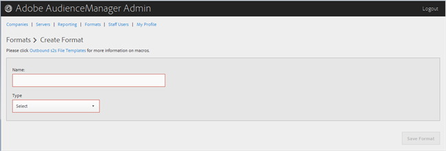

# 创建或编辑格式 {#create-or-edit-a-format}

使用Audience Manager管理工具中的[!UICONTROL Formats]页面创建新格式或编辑现有格式。

<!-- t_create_format.xml -->

>[!TIP]
>
>在为出站数据选择格式时，如果可能，最好重复使用现有格式。 使用已验证的格式可确保成功生成出站数据。 要准确查看现有格式的格式，请单击菜单栏中的[!UICONTROL Formats]选项，然后按名称或ID号搜索您的格式。 格式或格式中使用的宏格式不正确，将会提供格式不正确的输出或阻止完全输出信息。

1. 要创建新格式，请单击&#x200B;**[!UICONTROL Formats]** > **[!UICONTROL Add Format]**。 要编辑现有格式，请在&#x200B;**[!UICONTROL Name]**&#x200B;列中单击所需的格式。

   

1. 填写以下字段：
   * **名称：**（必需）为格式提供一个描述性名称。
   * **类型：**（必需）选择所需的格式：
      * **[!UICONTROL File]**：通过[!DNL FTP]文件发送数据。
      * **[!UICONTROL HTTP]**：将数据封装在[!DNL JSON]包装中。

1. （视情况而定）如果您选择&#x200B;**[!UICONTROL File]**，请填写以下字段：

   >[!NOTE]
   >
   >有关可用宏的列表，请参阅[文件格式宏](../formats/file-formats.md#concept_A867101505074418A58DE325949E5089)和[HTTP格式宏](../formats/web-formats.md#reference_C392124A5F3F42E49F8AADDBA601ADFE)。

   * **[!UICONTROL File Name]：**&#x200B;指定数据传输文件的文件名。
   * **标题：**&#x200B;指定数据传输文件第一行中显示的文本。
   * **[!UICONTROL Data Row]：**&#x200B;指定在文件的每个出站行中显示的文本。
   * **[!UICONTROL Maximum File Size (In MB)]：**&#x200B;指定数据传输文件的最大文件大小。 压缩文件必须小于100 MB。 未压缩文件大小没有限制。
   * **[!UICONTROL Compression]：**&#x200B;为您的数据文件选择所需的压缩类型： gz或zip。 要传递到[!UICONTROL AWS S3]，您必须使用.gz或未压缩文件。
   * **[!UICONTROL .info Receipt]：**&#x200B;指定生成传输控制([!DNL .info])文件。 [!DNL .info]文件提供了有关文件传输的元数据信息，以便合作伙伴能够验证Audience Manager是否正确处理了文件传输。 有关详细信息，请参阅用于日志文件传输的[传输控制文件](https://experienceleague.adobe.com/docs/audience-manager/user-guide/implementation-integration-guides/receiving-audience-data/batch-outbound-data-transfers/transfer-control-files.html?lang=en)。
   * **[!UICONTROL MD5 Checksum Receipt]：**&#x200B;指定生成[!DNL MD5]校验和回执。 [!DNL MD5]校验和回执，以便合作伙伴能够验证Audience Manager是否正确处理了完整传输。

1. （视情况而定）如果您选择&#x200B;**[!UICONTROL HTTP]**，请填写以下字段：

   * **[!UICONTROL Method]：**&#x200B;选择要用于传输过程的[!DNL API]方法：
      * **[!UICONTROL POST]：**&#x200B;如果您选择[!DNL POST]，请选择内容类型（[!DNL XML]或[!DNL JSON]），然后指定请求正文。
      * **[!UICONTROL GET]：**&#x200B;如果您选择[!DNL GET]，请指定查询参数。

1. 如果要创建新格式，请单击&#x200B;**[!UICONTROL Create]**；如果要编辑现有格式，请单击&#x200B;**[!UICONTROL Save Updates]**。

## 删除格式 {#delete-format}

1. 单击 **[!UICONTROL Formats]**。
2. 在所需格式的&#x200B;**[!UICONTROL Actions]**&#x200B;列中单击。
3. 单击&#x200B;**[!UICONTROL OK]**&#x200B;以确认删除。
